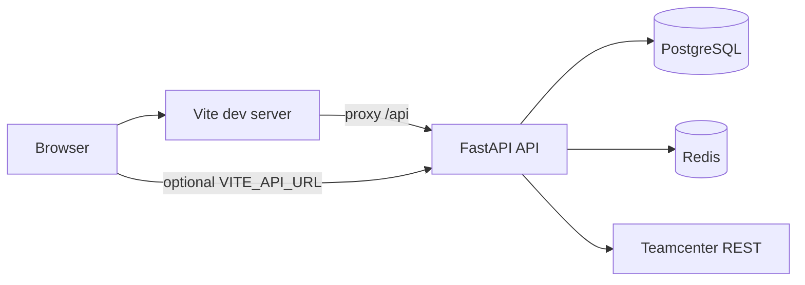

# Teamcenter Analytics

Web application that connects to **Siemens Teamcenter** over the same REST session flow as **Active Workspace (AWC)**, pulls session and optional follow-up data, and **persists normalized rows in PostgreSQL** for inspection in the UI.

## What it does

- **Authenticate operators** in the analytics app with JWT (FastAPI), separate from Teamcenter credentials.
- **Trigger fetch runs** that either use **mock sample data**, **Redis-backed cache** (when configured), or **live Teamcenter** via `httpx` (warmup GET, login POST with cookies and `X-XSRF-TOKEN`, then optional extra GETs).
- **Store results** as `FetchRun` + `TCObject` records (UID, type, name, revision, JSON `payload`).
- **Browse stored objects** in the React workbench with filtering tied to fetch runs.

## Architecture



| Layer | Technology |
| --- | --- |
| Frontend | React 18, TypeScript, Vite 5, Tailwind CSS, React Router 6 |
| Backend | Python 3.12, FastAPI, SQLAlchemy 2, psycopg2, httpx, Pydantic settings |
| Data | PostgreSQL 16, optional Redis 7 for fetch cache |
| Containers | Docker Compose (`api`, `web`, `db`, `redis`, one-shot `db-push`) |

## Repository layout

- `backend/` — FastAPI app (`app/main.py`), routes under `app/api/routes/`, Teamcenter client in `app/services/tc_rest_client.py`.
- `frontend/` — Vite + React SPA (`src/pages/Login.tsx`, `Workbench.tsx`).
- `docker-compose.yml` — full stack and published ports (**5173** web, **8000** API, **5432** Postgres, **6379** Redis).
- `.env.example` — documented environment variables (copy to `.env`).

## Quick start (Docker)

1. Copy environment template and set secrets:

   ```bash
   cp .env.example .env
   ```

   Edit `.env`: set `JWT_SECRET`, and for **live** Teamcenter set `TEAMCENTER_MOCK_MODE=false`, `TEAMCENTER_BASE_URL`, `TEAMCENTER_USER`, and `TEAMCENTER_PASSWORD`.

2. Start services:

   ```bash
   docker compose up --build
   ```

3. Open the UI using your machine **hostname or IP** and port **5173**. The API is on port **8000**; interactive docs are at `/docs` on the API port.

4. Optional: ensure tables exist (startup also runs `create_all`, but you can run the helper):

   ```bash
   docker compose run --rm db-push
   ```

### How the browser reaches the API

- **Default in Compose:** `VITE_API_URL` is empty and `VITE_PROXY_API_TARGET` points the Vite dev server at the `api` service. The UI calls relative `/api/...`; Vite proxies those to FastAPI.
- **Split origins:** set `VITE_API_URL` to the full public API origin and configure `CORS_ORIGINS` to include the UI origin.

## Local development (without Docker)

**API**

```bash
cd backend
pip install -r requirements.txt
export PYTHONPATH=.
# Set DATABASE_URL, REDIS_URL (optional), JWT_SECRET, Teamcenter vars — see .env.example
uvicorn app.main:app --reload --host 0.0.0.0 --port 8000
```

On Windows (cmd): `set PYTHONPATH=.` before `uvicorn`. On PowerShell: `$env:PYTHONPATH="."`.

**Frontend**

```bash
cd frontend
npm ci
npm run dev
```

Point `VITE_PROXY_API_TARGET` at your API (or set `VITE_API_URL`). Vite loads env from the **repository root** via `envDir` in `vite.config.ts`, so a root `.env` can hold `VITE_*` variables.

## Configuration reference

Values are read from `.env` (backend resolves repo root or `backend/.env`). Compose overrides `DATABASE_URL` and `REDIS_URL` for the `api` service.

| Variable | Purpose |
| --- | --- |
| `APP_NAME` | FastAPI title / health payload |
| `APP_ENV` | Environment label (e.g. `development`) |
| `DATABASE_URL` | SQLAlchemy URL (default host `db` matches Compose service name) |
| `REDIS_URL` | Optional; enables Redis cache for fetch payloads |
| `JWT_SECRET`, `JWT_ALGORITHM`, `ACCESS_TOKEN_EXPIRE_MINUTES` | JWT signing and lifetime |
| `ADMIN_USERNAME`, `ADMIN_PASSWORD` | Demo admin login for the analytics app |
| `TEAMCENTER_MOCK_MODE` | `true`: sample data only; `false`: live REST when configured |
| `TEAMCENTER_BASE_URL` | Teamcenter base URL (same host/port as AWC, e.g. `http://your-tc-host:3000`) |
| `TEAMCENTER_USER`, `TEAMCENTER_PASSWORD` | Teamcenter credentials for live fetch |
| `TEAMCENTER_WARMUP_PATH`, `TEAMCENTER_LOGIN_PATH` | Defaults match AWC-style session endpoints |
| `TEAMCENTER_CLIENT_*`, `TEAMCENTER_LOCALE` | Client metadata sent in login body (match your AWC build) |
| `TEAMCENTER_EXTRA_GET_PATHS` | Comma-separated paths to GET after login, same cookie jar |
| `CORS_ORIGINS` | Comma-separated allowed browser origins; **empty** allows `*` without credentials (JWT uses `Authorization`) |
| `VITE_API_URL` | Optional absolute API base; empty = relative `/api` |
| `VITE_PROXY_API_TARGET` | Vite dev proxy target for `/api` (e.g. `http://api:8000` in Compose) |

## HTTP API (summary)

Public and authenticated routes (JWT Bearer except login and health):

| Method | Path | Auth | Description |
| --- | --- | --- | --- |
| GET | `/health` | No | Liveness, env, mock mode, Redis availability |
| POST | `/api/auth/login` | No | Returns `access_token` |
| POST | `/api/fetch/runs` | Yes | Create fetch run; persists `TCObject` rows |
| GET | `/api/fetch/runs` | Yes | List recent runs |
| GET | `/api/fetch/runs/{run_id}` | Yes | Run detail |
| GET | `/api/objects` | Yes | List stored objects (`fetch_run_id`, pagination) |
| GET | `/api/objects/{object_id}` | Yes | Single object |

Full schemas appear in **OpenAPI** at `http://<api-host>:8000/docs`.

## Teamcenter integration

Live mode mirrors the browser flow: **GET** warmup on `TEAMCENTER_WARMUP_PATH`, then **POST** JSON to `TEAMCENTER_LOGIN_PATH` (`Core-2011-06-Session/login`) with `JSESSIONID` / `XSRF-TOKEN` handling and AWC-style `body.credentials` / `header.state`. Responses are normalized into rows; `serverInfo` becomes dedicated rows for dashboards. Configure extra reads via `TEAMCENTER_EXTRA_GET_PATHS` if you need additional REST GETs on the same session.

## Frontend

- **`/login`** — Analytics app login (JWT stored client-side).
- **`/`** — Workbench: run fetch, list runs, inspect JSON payloads.

## Scripts

| Script | Usage |
| --- | --- |
| `backend/scripts/db_push.py` | `create_all` for SQLAlchemy models (non-destructive). |
| `backend/scripts/tc_smoke_test.py` | Requires `TEAMCENTRE_API_BASE`; hits `/health`, login, and `POST /api/fetch/runs`. |

## Security notes

- Never commit `.env`; rotate `JWT_SECRET` and Teamcenter passwords in real deployments.
- Teamcenter passwords are only used server-side in the API process.
- Prefer HTTPS and restrictive `CORS_ORIGINS` in production; pair with a reverse proxy as needed.

## License / ownership

Add your organization’s license and contribution guidelines here if this repository is published.
