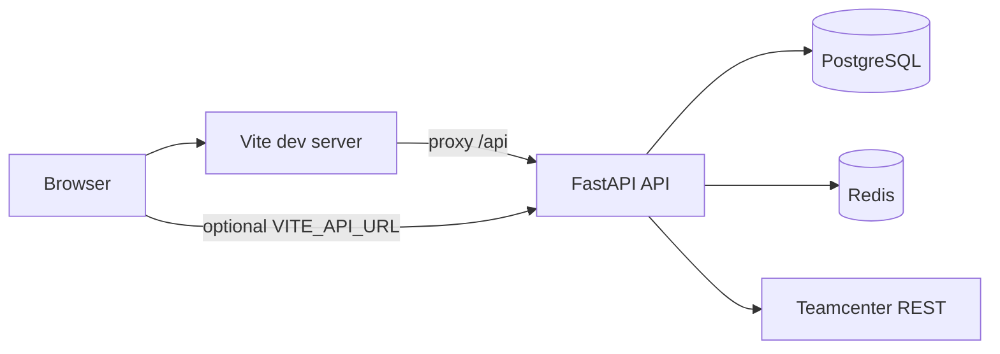

# Teamcenter Analytics

Web application that connects to **Siemens Teamcenter** over the same REST session flow as **Active Workspace (AWC)**, pulls session and optional follow-up data, and **persists normalized rows in PostgreSQL** for inspection in the UI.

## What it does

- **Authenticate operators** in the analytics app with JWT (FastAPI), separate from Teamcenter credentials.
- **Trigger fetch runs** that either use **mock sample data**, **Redis-backed cache** (when configured), or **live Teamcenter** via `httpx` (warmup GET, login POST with cookies and `X-XSRF-TOKEN`, then optional extra GETs).
- **Store results** as `FetchRun` + `TCObject` records (UID, type, name, revision, JSON `payload`).
- **Browse stored objects** in the React workbench with filtering tied to fetch runs.

## Architecture



| Layer | Technology |
| --- | --- |
| Frontend | React 18, TypeScript, Vite 5, Tailwind CSS, React Router 6 |
| Backend | Python 3.12, FastAPI, SQLAlchemy 2, psycopg2, httpx, Pydantic settings |
| Data | PostgreSQL 16, optional Redis 7 for fetch cache |
| Containers | Docker Compose (`api`, `web`, `db`, `redis`, one-shot `db-push`) |

## Repository layout

- `backend/` — FastAPI app (`app/main.py`), routes under `app/api/routes/`, Teamcenter client in `app/services/tc_rest_client.py`.
- `frontend/` — Vite + React SPA (`src/pages/Login.tsx`, `Workbench.tsx`).
- `docker-compose.yml` — full stack and published ports (**5173** web, **8000** API, **5432** Postgres, **6379** Redis).
- `.env.example` — documented environment variables (copy to `.env`).

## Install and run

### Prerequisites

**Option A — Docker (recommended)**  
[Docker Engine](https://docs.docker.com/engine/install/) and [Docker Compose v2](https://docs.docker.com/compose/install/) (`docker compose` CLI).

**Option B — Local tools only**  
Python **3.12+**, **Node.js 20+** (matching the frontend image), a running **PostgreSQL** instance (16+ is what Compose uses), and optionally **Redis** if you want fetch caching.

### Install and run with Docker Compose

1. **Clone** the repository (if you do not already have it):

   ```bash
   git clone <repository-url>
   cd <repository-directory>
   ```

2. **Create environment file** from the template:

   ```bash
   cp .env.example .env
   ```

3. **Edit `.env`** (required fields):

   - Set `JWT_SECRET` to a long random string (do not use the example value in production).
   - The UI login uses `ADMIN_USERNAME` / `ADMIN_PASSWORD` (defaults are often `admin` / `admin` until you change them).
   - For **live** Teamcenter: set `TEAMCENTER_MOCK_MODE=false`, `TEAMCENTER_BASE_URL`, `TEAMCENTER_USER`, and `TEAMCENTER_PASSWORD`.

4. **Build and start** all services (Postgres, Redis, API, Vite web):

   ```bash
   docker compose up --build
   ```

   Add `-d` to run in the background: `docker compose up --build -d`.

5. **Open the app**

   - **Web UI:** `http://<your-host>:5173` (use your machine’s hostname or IP, not only `127.0.0.1` if others need access).
   - **API docs (Swagger):** `http://<your-host>:8000/docs`
   - **Health check:** `http://<your-host>:8000/health`

6. **Optional — database schema helper** (the API also creates tables on startup; use this if you want to sync schema without starting the API):

   ```bash
   docker compose run --rm db-push
   ```

7. **Stop the stack**

   ```bash
   docker compose down
   ```

   To remove containers and the Postgres volume (wipes local DB data): `docker compose down -v`.

#### How the browser reaches the API (Docker)

- **Default:** `VITE_API_URL` is empty and `VITE_PROXY_API_TARGET` is `http://api:8000` in Compose. The browser loads the UI from Vite on port **5173**; requests to `/api/...` are **proxied** to the API container, so you do not need a hard-coded API URL in the frontend bundle.
- **Separate host/port for the API:** set `VITE_API_URL` to the full API origin (what the browser must call) and set **`CORS_ORIGINS`** to include the UI origin (comma-separated).

### Install and run without Docker

Use this when you prefer to run Postgres/Redis yourself or only part of the stack locally.

1. **Install backend dependencies**

   ```bash
   cd backend
   python -m venv .venv
   ```

   Activate the venv (Unix: `source .venv/bin/activate`; Windows PowerShell: `.\.venv\Scripts\Activate.ps1`), then:

   ```bash
   pip install -r requirements.txt
   ```

2. **Configure the environment** — copy `.env.example` to the **repository root** as `.env` and set at least `DATABASE_URL`, `JWT_SECRET`, and Teamcenter-related variables as needed (see **Configuration reference**).

3. **Run the API** from the `backend` directory:

   ```bash
   export PYTHONPATH=.
   uvicorn app.main:app --reload --host 0.0.0.0 --port 8000
   ```

   - Windows **cmd:** `set PYTHONPATH=.`
   - Windows **PowerShell:** `$env:PYTHONPATH="."`

4. **Install and run the frontend**

   ```bash
   cd frontend
   npm ci
   npm run dev
   ```

   Put `VITE_PROXY_API_TARGET` (and optionally `VITE_API_URL`) in the **repository root** `.env` — Vite is configured with `envDir` pointing at the repo root so those variables are picked up. Example for a local API on port 8000 on the same machine: set `VITE_PROXY_API_TARGET` to `http://127.0.0.1:8000` (or your LAN IP) so `/api` is proxied during `npm run dev`.

### First-time login

Open the web UI → **Login** → use `ADMIN_USERNAME` / `ADMIN_PASSWORD` from `.env`. After login you can run a fetch from the workbench and browse stored objects.

## Configuration reference

Values are read from `.env` (backend resolves repo root or `backend/.env`). Compose overrides `DATABASE_URL` and `REDIS_URL` for the `api` service.

| Variable | Purpose |
| --- | --- |
| `APP_NAME` | FastAPI title / health payload |
| `APP_ENV` | Environment label (e.g. `development`) |
| `DATABASE_URL` | SQLAlchemy URL (default host `db` matches Compose service name) |
| `REDIS_URL` | Optional; enables Redis cache for fetch payloads |
| `JWT_SECRET`, `JWT_ALGORITHM`, `ACCESS_TOKEN_EXPIRE_MINUTES` | JWT signing and lifetime |
| `ADMIN_USERNAME`, `ADMIN_PASSWORD` | Demo admin login for the analytics app |
| `TEAMCENTER_MOCK_MODE` | `true`: sample data only; `false`: live REST when configured |
| `TEAMCENTER_BASE_URL` | Teamcenter base URL (same host/port as AWC, e.g. `http://your-tc-host:3000`) |
| `TEAMCENTER_USER`, `TEAMCENTER_PASSWORD` | Teamcenter credentials for live fetch |
| `TEAMCENTER_WARMUP_PATH`, `TEAMCENTER_LOGIN_PATH` | Defaults match AWC-style session endpoints |
| `TEAMCENTER_CLIENT_*`, `TEAMCENTER_LOCALE` | Client metadata sent in login body (match your AWC build) |
| `TEAMCENTER_EXTRA_GET_PATHS` | Comma-separated paths to GET after login, same cookie jar |
| `CORS_ORIGINS` | Comma-separated allowed browser origins; **empty** allows `*` without credentials (JWT uses `Authorization`) |
| `VITE_API_URL` | Optional absolute API base; empty = relative `/api` |
| `VITE_PROXY_API_TARGET` | Vite dev proxy target for `/api` (e.g. `http://api:8000` in Compose) |

## HTTP API (summary)

Public and authenticated routes (JWT Bearer except login and health):

| Method | Path | Auth | Description |
| --- | --- | --- | --- |
| GET | `/health` | No | Liveness, env, mock mode, Redis availability |
| POST | `/api/auth/login` | No | Returns `access_token` |
| POST | `/api/fetch/runs` | Yes | Create fetch run; persists `TCObject` rows |
| GET | `/api/fetch/runs` | Yes | List recent runs |
| GET | `/api/fetch/runs/{run_id}` | Yes | Run detail |
| GET | `/api/objects` | Yes | List stored objects (`fetch_run_id`, pagination) |
| GET | `/api/objects/{object_id}` | Yes | Single object |

Full schemas appear in **OpenAPI** at `http://<api-host>:8000/docs`.

## Teamcenter integration

Live mode mirrors the browser flow: **GET** warmup on `TEAMCENTER_WARMUP_PATH`, then **POST** JSON to `TEAMCENTER_LOGIN_PATH` (`Core-2011-06-Session/login`) with `JSESSIONID` / `XSRF-TOKEN` handling and AWC-style `body.credentials` / `header.state`. Responses are normalized into rows; `serverInfo` becomes dedicated rows for dashboards. Configure extra reads via `TEAMCENTER_EXTRA_GET_PATHS` if you need additional REST GETs on the same session.

## Frontend

- **`/login`** — Analytics app login (JWT stored client-side).
- **`/`** — Workbench: run fetch, list runs, inspect JSON payloads.

## Scripts

| Script | Usage |
| --- | --- |
| `backend/scripts/db_push.py` | `create_all` for SQLAlchemy models (non-destructive). |
| `backend/scripts/tc_smoke_test.py` | Requires `TEAMCENTRE_API_BASE`; hits `/health`, login, and `POST /api/fetch/runs`. |

## Security notes

- Never commit `.env`; rotate `JWT_SECRET` and Teamcenter passwords in real deployments.
- Teamcenter passwords are only used server-side in the API process.
- Prefer HTTPS and restrictive `CORS_ORIGINS` in production; pair with a reverse proxy as needed.


